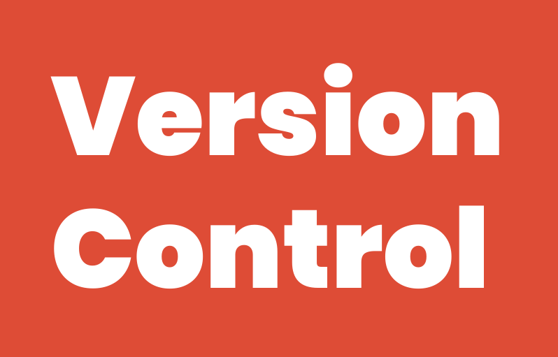

Version Control Lab 2

#Remove dev branch 
Local: 
git branch -d dev 
Remote: 
git push origin :dev  

#Remove test branch 
Local: 
git branch -d test 
Remote: 
git push origin :test  

#checkout another branch without commit changes 
git stash  

#List tags 
git tag  

#Remove tag 
Local: 
git tag -d v1.7 
Remote: 
git push origin --delete v1.7  

<<<<<<< HEAD

=======
>>>>>>> origin/main
